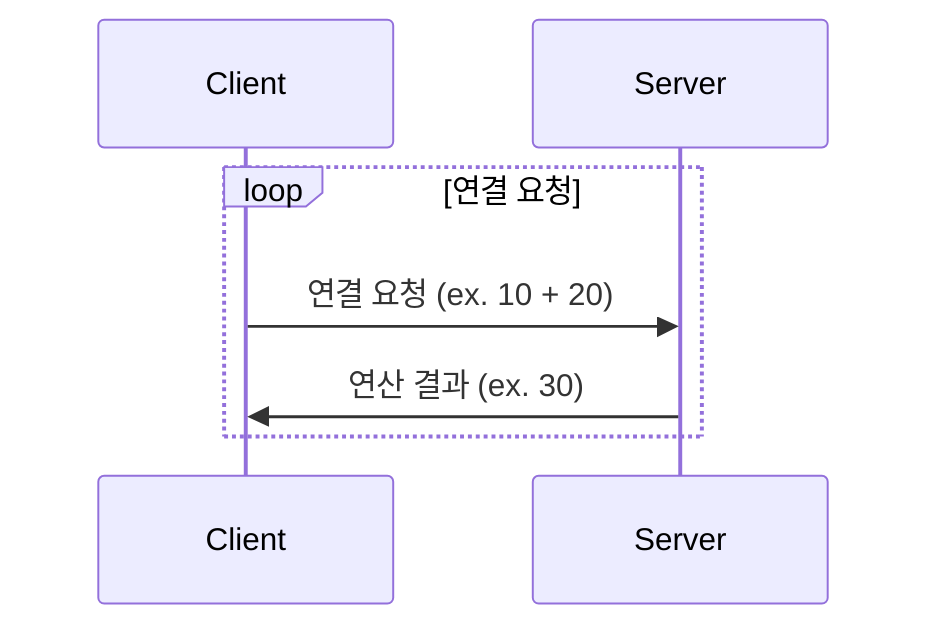
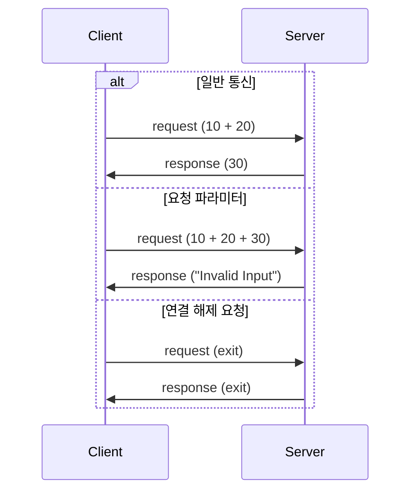

# Calculator Project

## Description

> This is a simple calculator project in java with a thread.

### Requirements

1. Cilent와 Server 통신을 위한 Socket 프로그래밍
2. Client에서 Server로 연산 요청을 보내고, Server에서 연산 결과를 Client로 보내는 프로그램
3. 통신 규칙을 적용할 것
4. 통신에 필요한 데이터는 server_info.dat 파일을 이용할 것
5. 연산은 Thread를 이용하여 처리할 것
6. 4번의 과정이 실패하면 default 값을 이용할 것

### Sequence Diagram

- 일반 통신

- 요청 문제 발생
